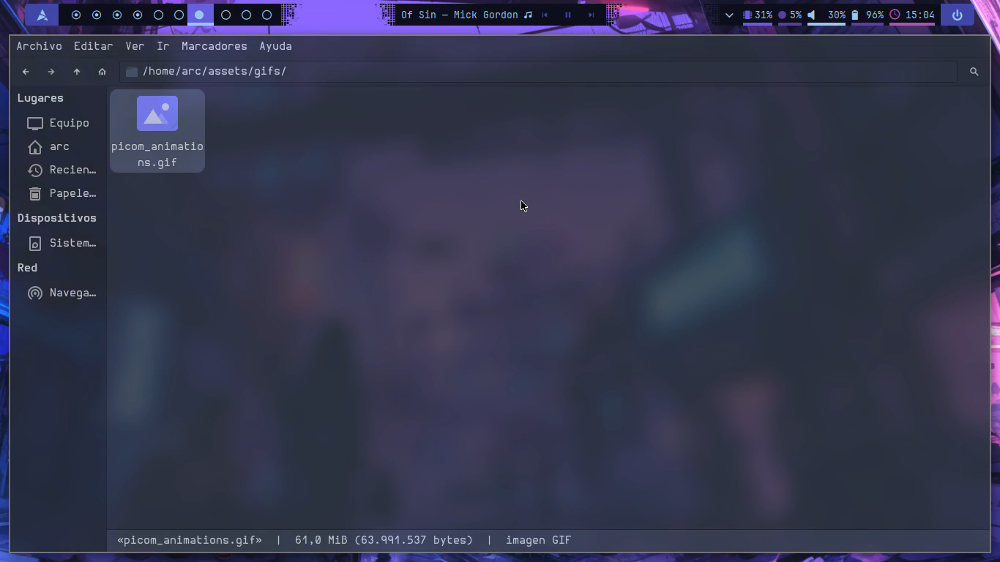

# Picom

Click to reproduce!

Alternative for GitHub (click to see)

https://github.com/user-attachments/assets/037136dd-ebcb-41e0-a678-54412569153e

This configuration sets the transparency, blur and animations used on windows.

Its independent of the wm you use, so it should work properly wherever you use
it.
