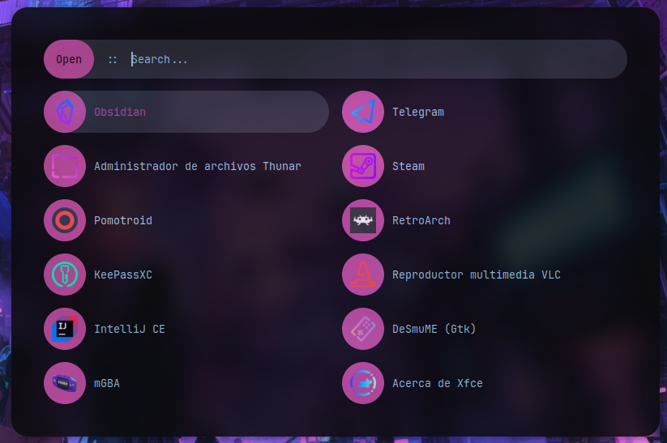

# Rofi configuration

This configuration was taken (i think so, i can't remember it) from this [repo](https://github.com/adi1090x/rofi)

I just made some modifications and now you need to install:

- Hack Nerd Font.
- JetBrains Nerd Font.
- And [candy-icons](https://www.gnome-look.org/s/Gnome/p/1305251/)
