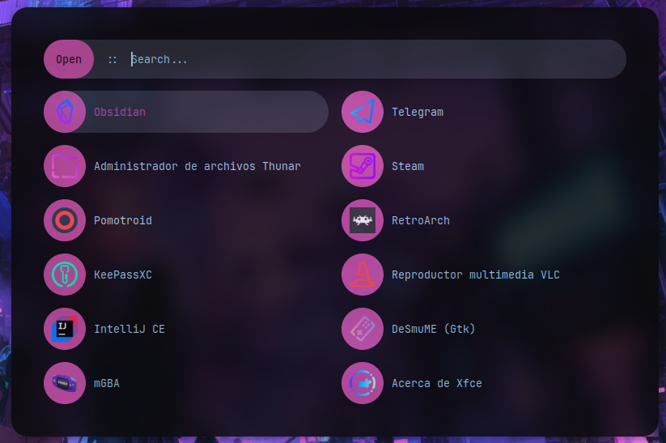
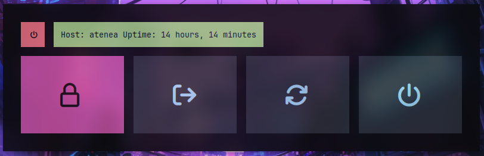

# Rofi Configuration




This configuration was taken (i think so, i can't remember it) from this
[repo](https://github.com/adi1090x/rofi). I just made some little adjustments.

## Quickstart

Before you install this configuration, you need:

- [Hack and JetBrains Nerd Font](https://www.nerdfonts.com/font-downloads)
- [Candy-icons](https://www.gnome-look.org/s/Gnome/p/1305251/)

Then clone this repo and run:

```sh
# Install rofi
sudo pacman -S --needed rofi

# Copy configuration
cp -r dofiles/.config/rofi ~/.config
```

## Customize

If you don't use the `set_update_wallpapper.sh` script, and you just want to
set the colors by hand, you can edit the `colors/theme-pywal.rasi` to use the
colors that you want.

The files `themes/launcher.rasi` and `themes/power-menu.rasi` set the look of
those menus with rofi. The last file is used by the `power_menu_rofi.sh` script,
so if you don't use that script, you can remove it.

The `config.rasi` file sets the default configuration. This is in case that the
`themes/launcher.rasi` breaks.

If you want to change the fonts, you can change them on `shared/fonts.rasi`,
`config.rasi` and `power-menu.rasi` (line 151).
